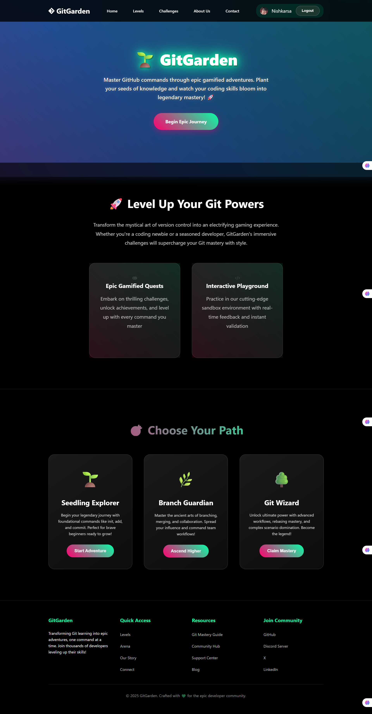
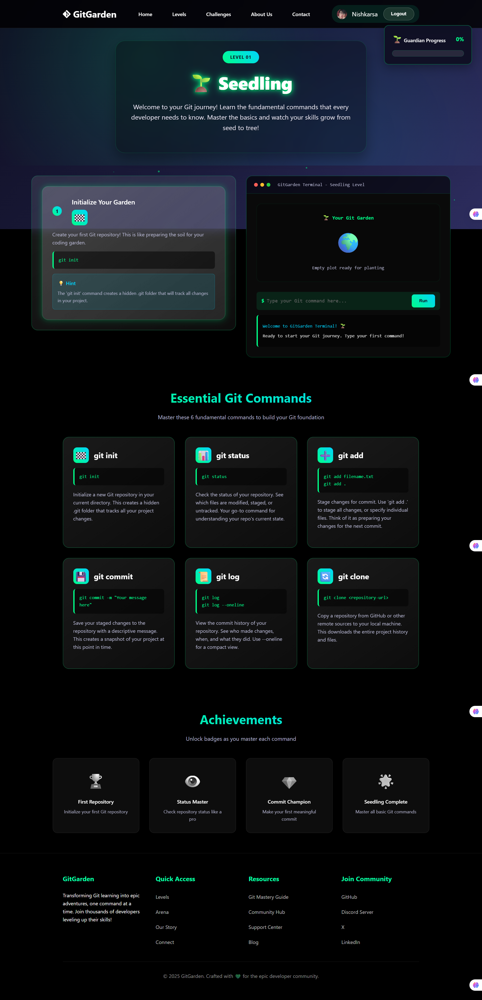
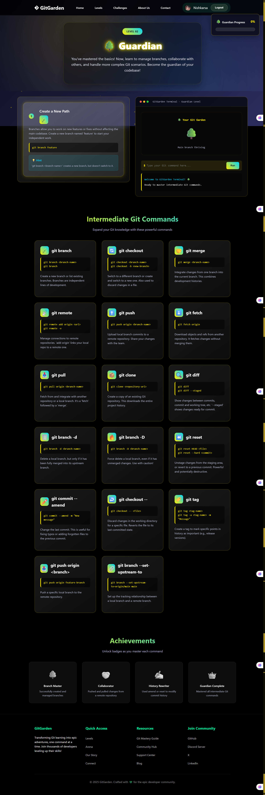
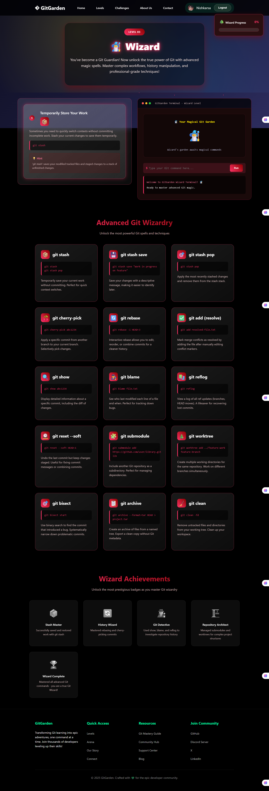
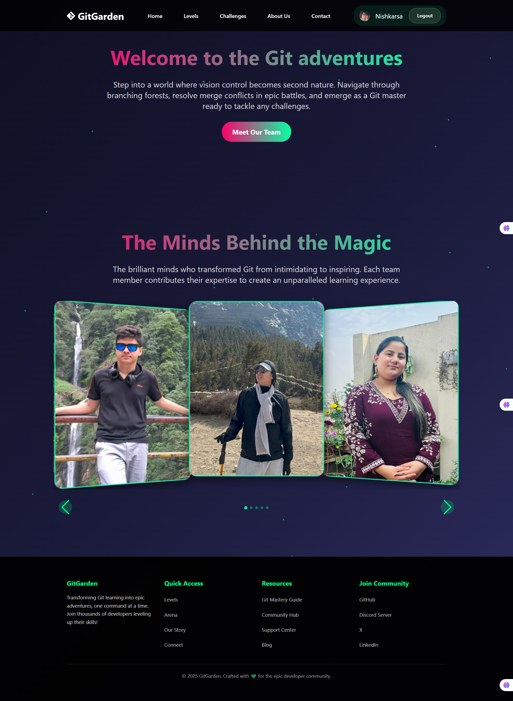
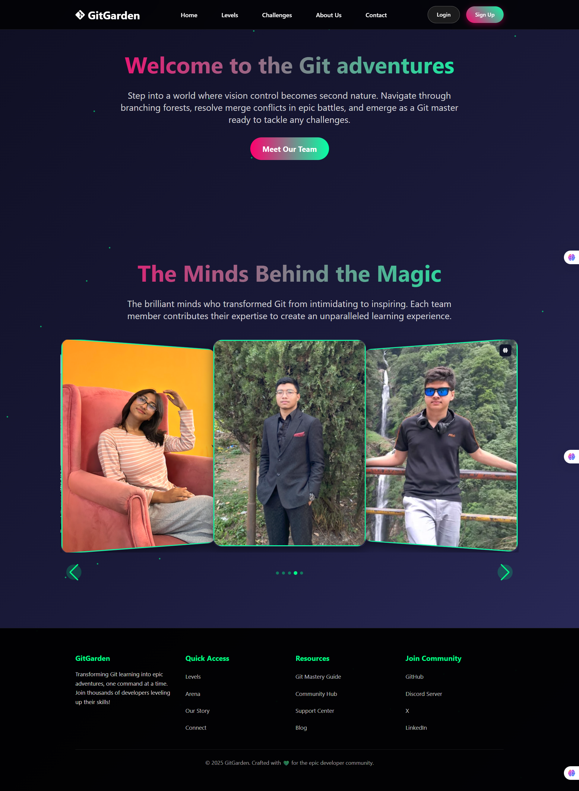
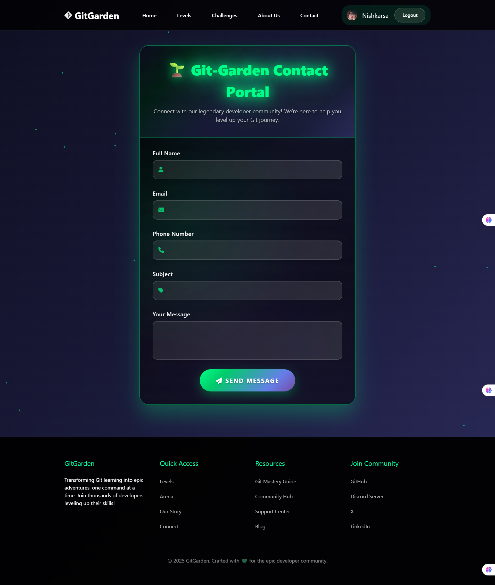
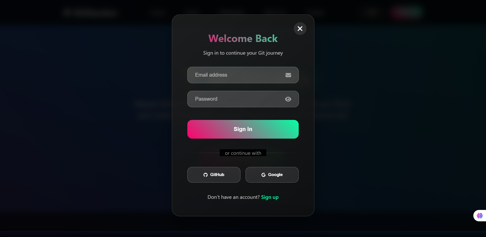

# GitGarden: Cultivate Your Git Skills

GitGarden is an interactive and gamified web platform designed to help developers master Git commands and concepts through engaging challenges and structured learning paths.

---

## Table of Contents
- [Features](#features)
- [Getting Started](#getting-started)
  - [Prerequisites](#prerequisites)
  - [Installation](#installation)
  - [Running the Project](#running-the-project)
- [Project Structure](#project-structure)
- [Usage](#usage)
  - [Learning Levels](#learning-levels)
  - [Git Warrior Challenges](#git-warrior-challenges)
- [About Us](#about-us)
- [Contact Us](#contact-us)
- [Contributing](#contributing)
- [License](#license)
- [Acknowledgments](#acknowledgments)

---

## Features
- Gamified Learning: Progress through levels (Beginner, Intermediate, Advanced) with interactive exercises.
- Git Warrior Challenges: Engage in a terminal environment to test your Git knowledge.
- Interactive Terminal: Practice Git commands directly within the browser.
- User Authentication: Secure login and sign-up functionality using Firebase.
- Responsive Design: Optimized for various screen sizes.
- Team Showcase: An "About Us" page featuring the project team.
- Contact Form: A dedicated page for user inquiries and feedback.
- Animated Backgrounds: Engaging visual effects to enhance user experience.

---

## Getting Started

### Prerequisites
Before setting up the project, ensure you have the following:
- Git: [Download here](https://git-scm.com/)
- A modern web browser (Chrome, Firefox, or Edge).
- (Optional) Live Server extension for VS Code.

### Installation
Clone the repository:
```bash
git clone https://github.com/your-username/gitgarden.git
```
### Navigate into the Project Directory
Navigate into the project folder:

```bash
cd gitgarden
```


## Running the Project
Open the `index.html` file directly in your browser.

*(Optional)* If using VS Code, right-click `index.html` and select **"Open with Live Server"**.


## Project Structure

```bash
gitgarden/
├── index.html                # Main landing page of the application
├── CSS/
│   └── styles.css            # Core CSS styling for the application
├── Script/
│   ├── firebase-auth.js      # Firebase authentication logic
│   ├── minimal-auth.js       # Minimal authentication logic
│   ├── javascript.js         # General JavaScript functionalities
│   ├── shared-auth.js        # Shared authentication logic
│   └── contact.js            # Logic for the contact form
├── HTML/
│   ├── about_us.html         # Information about the GitGarden team
│   ├── challenges.html       # "Git Warrior: Code Conquest" game
│   ├── contact_us.html       # Contact form page
│   └── level_advanced.html   # Advanced Git learning level
├── Assets/Image/
│   ├── Nishkarsa_img.png
│   ├── prapti_img.png
│   ├── Ratul_img.png
│   ├── tanisha_img.jpg
│   └── Udip_img.png
└── README.md
```
## Usage

### Learning Levels
Navigate to the **"Levels"** section from the homepage to access structured learning paths:

- **Beginner**: Learn the basics of Git.
- **Intermediate**: Explore branching and merging.
- **Advanced**: Master complex workflows.

---

### Git Warrior Challenges
Visit the **"Challenges"** page to play **"Git Warrior: Code Conquest"**.  
Enter Git commands into the terminal to complete challenges.

---

### About Us
Discover the team behind **GitGarden** on the **"About Us"** page, featuring profiles of each member.

---

### Contact Us
Use the **"Contact Us"** page to send inquiries or provide feedback.

---

## Contributing

We welcome contributions! Follow these steps to contribute:

### 1. Fork the repository.

### 2. Create a new branch:
```bash
git checkout -b feature/your-feature-name
```

### 3. Make Your Changes
Edit the necessary files to implement your feature or fix.

---

### 4. Stage Your Changes
```bash
git add .
```

---

### 5. Commit Your Changes
```bash
git commit -m "feat: Add new feature X"
```

---

### 6. Push Your Branch
```bash
git push origin feature/your-feature-name
```

---

### 7. Open a Pull Request
After pushing your branch, open a **Pull Request** to the **main** branch.

---

## License
This project is open-source and available to all.

---

## Acknowledgments

- **Firebase**: For user authentication.
- **Font Awesome**: For icons.
- **Swiper.js**: For the carousel.
- **Tailwind CSS**: For styling.
- **The Git Community**: For resources and inspiration.

---

## Screenshots


---

---

---

---

---

---

---
